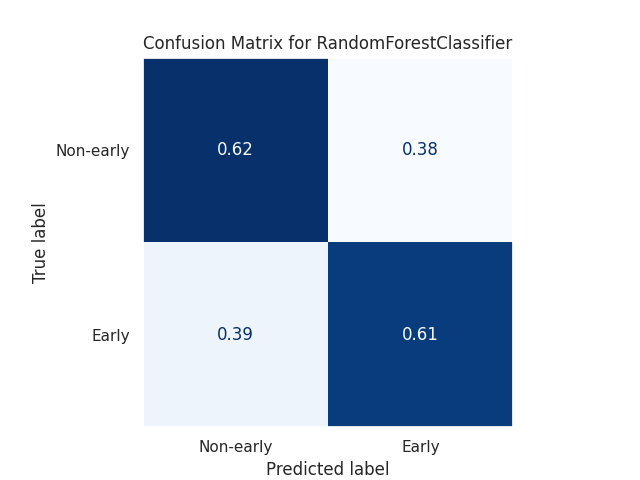
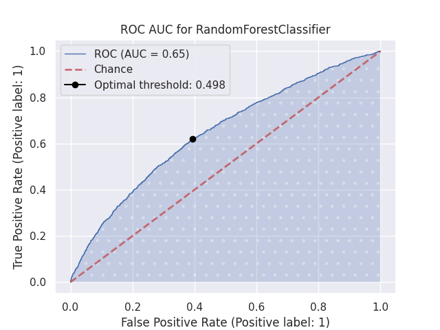

Predicting Early Readmission in Diabetic Patients
==============================

In this project, we attempt to build a generalized model to solve a binary classification task of predicting whether or not a diabetes patient will readmit into the hospital within 30 days.

A technical summary of the work and findings can be found in the [Summary of Work](#2.-Summary-of-Work) section. If you'd like to reproduce the model, please follow the [Reproducing the Workflow](#4.-Reproducing-the-Workflow) section.

# 0. Table of Contents

1. [Data](#1.-Data)
3. [Summary of Work](#2.-Summary-of-Work)
3. [Project Organization](#3.-Project-Organization)
4. [Reproducing the Workflow](#4.-Reproducing-the-Workflow)

# 1. Data

The raw [dataset](https://archive.ics.uci.edu/ml/datasets/diabetes+130-us+hospitals+for+years+1999-2008) was retrieved from the UCI Machine Learning repository. It was uploaded on behalf of the Center for Clinical and Translational Research at Virginia Commonwealth University.

It includes over 50 features representing patient and hospital outcomes from 130 U.S. hospitals between the years 1999 to 2008. All observations abide by the following criteria:
1. It is an inpatient encounter
2. It is a diabetic encounter
3. The length of stay was at least 1 day and at most 14 days
4. Laboratory tests were performed during the encounter
5. Medications were administered during the encounter

The data contains attributes such as patient number, race, gender, age, admission type, time in hospital, medical specialty of admitting physician, number of lab test performed, HbA1c test result, diagnosis, number of medication, diabetic medications, number of outpatient, inpatient, and emergency visits in the year before the hospitalization. More information can be found on the UCI Machine Learning repository listing [here]((https://archive.ics.uci.edu/ml/datasets/diabetes+130-us+hospitals+for+years+1999-2008)).

# 2. Summary of Work

This summary provides the highlights of each part of the data science lifecycle. I suggest viewing each notebook individually to see more detailed analyses.

## 2.1 Data Wrangling

In the notebook [`notebooks/0_data_wrangling.ipynb`](https://github.com/uncanny-valley/diabetes-readmission/blob/master/notebooks/0_data_wrangling.ipynb), we perform basic operations like cleaning, imputation, and outlier handling. 

The data contained 101,766 observations spanning 50 columns (47 independent variables, 1 encounter index, 1 patient index, 1 dependent variable. 9 features were numerical and the remainder were categorical. The dependent variable includes three values: readmits within 30 days, does not readmit, or readmits after 30 days. We transpose this into a binary classification task by conflating the last two values, only predicting whether or not a patient readmits within 30 days of initial hospital admission (early readmission). 

The observations were not statistically independent because patients could have multiple inpatient encounters. Enforcing statistical independence reduced the size of the dataset to 71,518 observations, a ~29.7% reduction. 

9 features (race, weight, payer code, diagnoses (3), medical specialty, max glucose serum test, and hbA1c result) contained missing or null values:

- Weight was missing more than 96% of its data, so it was dropped completely.
- Only about 2.7% of the race feature were missing. Because other features in these observations were not missing, we opted to encode this unavailability as a Not Available category in the race feature. 
- About 49% of medical specialties were not available. Because not needing to see a specialist could be indicative of certain health conditions that may be correlated with early or non-early readmission, we classified missing data as its own category.
- Most patient encounters contain a primary diagnosis. The primary, secondary, and tertiary diagnosis had 0.01%, and 0.4% and 1.7% missing values respectively. All missing values were classified as its own category.
- About 81% and 95% of hemoglobin A1c test results and glucose serum test results were missing respectively. Not having taken or having unavailable results may encode some amount of information, so we decided to classify missing data as its own category.
- The payer code, the ID that corresponds to the method that the patient used to pay for their treatment, had a 43% missing value rate. However, not having a payment method may be indicative of a particular socioeconomic status that may influence readmission. We classified missing data as 'NA', Not Available.
- There were no missing data for numerical features.

Based on inter-quartile range, we found that the feature with the largest amount of outliers was the number of inpatient encounters. We see later that many of these numerical features are skewed left, where it is common for observations to contain 0 or 1 values. As a result, realistic values are viewed as outlying. With this in mind, we decide to keep these outliers and try to reduce its skew through transformation.

## 2.2 Exploratory Data Analysis

In the notebook [`notebooks/1_eda.ipynb`](https://github.com/uncanny-valley/diabetes-readmission/blob/master/notebooks/1_eda.ipynb), we visualize our interim data exported by our last notebook in order to identify latent patterns that can potentially inform our model.

We recognized the imbalanced nature of our dataset, where positive observations (patients who were readmitted early) only accounted for about 9% of our data.

    

**Figure 1.** This indicated that total accuracy was not a good measure of success, as an naive learner that predicts no early readmission 100% of the time will yield over 91% accuracy. Using a confusion matrix, precision, recall, and other metrics in combination with accuracy may help establish a better idea on how our learner is performing. This eventually led us to re-sample the dataset to restore balance in our training set.

By scanning the data, it was clear that this data was not easily linearly separable. As an illustrative sample, we projected the dimensionality of numerical features to a lower dimensional space via principal component analysis, plotting its cumulative percentage of explained variance by number of components and the first two principal components in a scatter plot.

    

**Figure 2a.** According to the left-hand figure, there is not one numerical feature that is responsible for most of the variance in the dataset. **Figure 2b.** Although two components only explains about 40% of the data variance, we can see on the right-hand figure that the early readmission patients (red) and non-early readmission patients (blue) are similar positionally within a 2-dimensional Euclidean space.

### 2.2.1 Categorical Features
- There were discharge categories related to hospice or death, which means that these patients will definitely not be readmitted to the hospital. Observations with the following features were to be removed in the feature engineering phase:
    - Expired
    - Hospice / home
    - Hospice / medical facility
    - Expired at home. Medicaid only, hospice.
    - Expired in a medical facility. Medicaid only, hospice.
    - Expired, place unknown. Medicaid only, hospice.
- Patients who were not readmitted early tended to be discharged to their home more often that the early readmission group (0.64 vs 0.50). See **Figure 3**.
- Patients who had been readmitted early tended to be older, and more likely to be in the 70-90 age range than those who were not readmitted early. See **Figure 4**.
- Caucasian patients accounted for about 75% of the dataset. The next largest racial or ethnic group was African Americans at about 18%.
- Patients with hemiplegia or paraplegia, mild liver disease, peripheral vascular disease, cerebrovascular disease, diabetes with chronic complications, and  metastatic tumors have a noticeably higher proportion of early readmission than those who do not.
- Positive observations had a higher proportion of unavailable healthcare payer codes. This could indicate that (1) these patients tended to not have measures to pay for their treatment, that (2), circumstantially, these codes were neglected to be reported for a higher proportion of this group, or (3) some other reason unknown to us. Positive observations had a slightly higher proportion of Medicare payer codes, which may make sense in that Medicare, a national US healthcare program, is often given toward individuals 65 or older, or those with a pre-existing disability. Older patients may be more susceptible to severe illness, which may warrant earlier re-hospitalization. Overall, about 44% of all payer codes were unavailable so this may be an unreliable predictor of early readmission.
- Patients who were readmitted early had a higher incidence of circulatory issues as a primary diagnosis. Similarly, non-early readmission patients had a higher incidence of respiratory illness as a primary diagnosis (See **Figure 5**). Circulatory diagnoses dominate all three diagnosis categories, but are not clearly favored by one group.
- Many of the medication features were fairly homogeneous. Examide, citoglipton and glimepiride-pioglitazone were completely homogeneous. Exceptions to this were metformin and insulin, which both had the highest amount of variability in their prescription change status.

**Figure 3**: A grouped bar plot visualizing the proportion of discharge types within each readmission status group: early readmission (1) and non-early readmission (0). Non-early readmission patients tend to be discharged to their homes more often than early readmission patients, who tend to be discharged to a skilled nursing facility.

**Figure 4**: A grouped bar plot visualizing the proportion of age brackets within each readmission status group: early readmission (1) and non-early readmission (0). Both distributions are skewed a bit left, containing patients mainly in the 50-90 age range. We observe a higher incidence of 70-90 year old patients in the early readmission group than the non-early readmission group.

**Figure 5**: A grouped bar plot visualizing the proportion of primary diagnoses within each readmission status group: early readmission (1) and non-early readmission (0). Patients who were readmitted early had a higher incidence of circulatory issues as a primary diagnosis. Conversely, non-early readmission patients had a higher incidence of respiratory and digestive illness as a primary diagnosis.

### 2.2.2 Numerical Features

The numerical features include days in the hospital, number of lab procedures, number of procedures, number of emergency visits, number of inpatient encounters, number of outpatient encounters, number of medications, number of diagnoses. These features were generally uncorrelated with exception to number of medications and days in the hospital ($r$ = 0.47) and number of medications and number of procedures ($r$ = 0.4). We can speculate that a confounding factor could be the severity of or susceptibility to illness, which could warrant a longer stay or higher number of medications or testing procedures.

We log-transformed and scaled our numerical features to have a center of 0 and a standard deviation of 1. Most of the resulting distributions were left or right-skewed. Features like the number of inpatient, outpatient, and emergency encounters commonly had a zero value, so common that a value of 1 was considered an outlier. We examined outliers and realized that many were many were, in fact, valid or reasonable, and may encode some importance in distinguishing between the two target groups.

    

**Figure 6**: Grouped box plots, comparing distributions of various log-transformed, scaled numerical features in early readmission and non-early readmission groups. Mostly all distributions are skewed left (number of diagnoses, age, number of lab procedures) or right (number of inpatient and outpatient encounters, number of emergency visits, number of procedures). 

## 2.3 Feature Engineering

In the notebook [`notebooks/2_features.ipynb`](https://github.com/uncanny-valley/diabetes-readmission/blob/master/notebooks/2_features.ipynb), we prepared features to be ingested by our models. We constructed a feature engineering pipeline where the input data is the data generated from 2.1 and the output is the data that will be passed into our model. The pipeline contains three independent pipelines that process numerical, ordinal, and nominal features:

    

**Figure 7**:

1. **Column Filter**: Filters out unwanted columns based on our prior exploratory data analysis.
2. **Row Filter**: Drops observations based on a given condition. This was used to drop hospice and neonatal observations that we found necessary to remove in 2.2.
3. **Numerical Features Sub-pipeline:**
    - **Median Imputation**: Impute missing values with the median of each column.
    - **Log Transformer**: Log-transforms all columns for additivity and to promote normality.
    - **Standard Scaler**: Centers the data with a mean and standard deviation at 0 and 1 respectively.
    - **Feature Combiner**: Creates compound features composed of various existing features. This generates a feature called service utilization, which is the total number of visits to hospital services.
    - **Variance Threshold**: Removes homogeneous features that have a variance lower than a particular threshold. The chosen threshold was 0.1.
4. **Ordinal Features Sub-pipeline:**
    - **Most Frequent Imputation**: Imputes missing values with the most frequently occurring feature value.
    - **Ordinal Encoder**: Maps each category to an index.
    
5. **Nominal Features Sub-pipeline:**
    - **Encode NaN Categorical Imputer**: Encodes null or unavailable values as its own category for a given set of features, since these values can imply some information.
    - **Most Frequent Imputation**: Imputes missing values with the most frequently occurring feature value. We apply this imputer on the features that have not used the Encode NaN Categorical Imputer.
    - **Feature Combiner**:  Creates compound feature composed of various existing categorical features. We use this to create `diagnosis_diversity`, which measures the heterogeneity in the primary, secondary, and tertiary diagnosis reported.
    - **Diagnosis Comorbidity Extractor**: Extracts binary predicates that indicate whether the patient had a particular type of disease
    - **Diagnosis Mapper**: Converts ICD9 codes into two tiers of classifications (t1, t2), differing by specificity. t2 is more general than t1.
    - **Homogeneity Threshold**: Removes features if they're too homogeneous, based on Shannon Entropy. The chosen threshold was 0.05.
    - **Category Collapse Threshold**: Collapses feature values that occur less than X% of the time into a single value. The chosen threshold was 5%.
6. **Collinearity Threshold**: Removes one of each pair of correlated features where their absolute Pearson correlation coefficient is greater than 0.9.

We took an 80:20 training:testing dataset split, fit our preprocessing pipeline on the training set, and transformed and exported both datasets.

## 2.4 Model Selection

In the notebook [`notebooks/3_modeling.ipynb`](https://github.com/uncanny-valley/diabetes-readmission/blob/master/notebooks/3_modeling.ipynb), we defined a suite of metrics that would be most useful in evaluating models with respect to our data. We decided to evaluate models with precision, recall, f2-score, and ROC AUC due to the majority-minority class imbalance in our dataset. 

A false negative (a patient who fails to be classified as someone who will likely re-admit within 30 days) has much more dire health and financial implications than those of a false positive. With that in mind, we prioritize the recall score and weighted metrics like the f2-score, as we would like to minimize false negatives.

Class imbalance risks biasing our models by exposing them to a disproportionate number of observations per class. We explored sampling methods to counteract this. We experimented with SMOTE (Synthetic Minority Oversampling Technique), random oversampling the minority class, and random undersampling the majority class. We then performed 3-fold cross-validation on each of these generated datasets to determine which method yielded the best overall performance and to also get a general idea of which types of models are most effective in learning from our data. 

The types of models we tested were logistic regression, decision trees, random forests, gradient boosted trees, Light GBM, and XGBoost. We also compared them to benchmark classifiers like dummy and [LACE Index](https://www.ncbi.nlm.nih.gov/pmc/articles/PMC5374974/) classifiers.  Random undersampling yielded higher recall values on average, without sacrificing precision or ROC AUC. SMOTE performed the worst on average among all non-dummy models. Logistic regression and tree-based ensemble methods performed well on average. Random forest and LGBM were selected for hyperparameter tuning due to their flexibility and reasonable training speed.

## 2.5 Hyperparameter Optimization

In the notebook [`notebooks/4_hyperparameter_optimization.ipynb`](https://github.com/uncanny-valley/diabetes-readmission/blob/master/notebooks/4_hyperparameter_optimization.ipynb), we sought to improve our baseline performance through tuning our model's hyperparameters. We focus on random forest and LGBM classifiers. We first establish a benchmark in the [LACE Index](https://www.ncbi.nlm.nih.gov/pmc/articles/PMC5374974/), a heuristic that help physicians determine whether a patient is at risk of early readmission.

    
    

**Figure 8a**: The LACE index only yields a performance slightly better than chance in identifying non-early readmission patients. It performs worse than random at identifying early readmission patients, only successfully identifying 49% of these observations. **Figure 8b**: We see this translate to the ROC graph, which is an aggregate measure of performance across all classification thresholds, only yielding an AUC of 0.54.

We generated multiple datasets in an effort to reduce the dataset's original 80 features and reduce overfitting. We performed recursive feature elimination to select the optimal subset of features that yielded the highest average ROC AUC score over 5 cross-validated folds. We used random forest as our base classifier for this incremental feature elimination. The best performance required 76 features. The most relevant features were the log-transformed numerical features in the number of lab procedures, days in the hospital, number of medications, the number of procedures, number of diagnoses, and the diversity of the three given diagnoses. Age and whether the patient was discharged to their home were also important. A notable observation is that these feature importances are all extremely low in weight, meaning there did not exist a ubiquitous feature that proved to be a key indicator for all trees that analyzed various subsets of data.

**Figure 9**: We performed recursive feature elimination to select the optimal subset of features that yielded the highest average ROC AUC score over 5 cross-validated folds. The best performing classifier used 76 of 80 features. The most relevant features were the log-transformed numerical features in the number of lab procedures, days in the hospital, and number of medications.

We used Optuna, a hyperparameter optimization framework, to more efficiently navigate our hyperparameter search space. We conducted 32 studies, $M\ \times\ D\ \times\ O$, where:

- $M$ is the model type (random forest, LGBM). These models yielded the consistent cross-validation results in our model selection phase.
- $D$ is the dataset type (undersampled, undersampled + feature selected via RFECV, undersampled + feature selected based on feature importance during k-fold CV, top 25 most relevant features)
- $O$ is our maximization objective (recall, $f\beta$-score ($\beta=\{1,2\})$, ROC AUC)

Our best classifier was on the RFE-reduced dataset, optimizing for the f1-score. It was able to identify 62% of non-early readmission patients and 60% of early readmission patients against a standard 0.5 classification threshold. Considering all classification thresholds, it yielded an ROC AUC of 0.64, with an optimal threshold at 0.5. We observe a 18.5% difference in the ROC AUC, compared to the LACE Index.

    
    

**Figure 9a**: The normalized confusion matrix for our final random forest classifier. The model is able to identify 60% of early readmission patients and 62% of non-early readmission patients. **Figure 9b**: The final model yields a ROC AUC of 0.64, which can be interpreted as the probability that our model labels a future early readmission as positive. We observe a 18.5% difference in the ROC AUC, compared to the LACE Index.

## 2.6 Future Work

## 2.6.1 Patient Stratification
We attempted to create a generalized model for predicting early readmission. However, it did not yield decisive, satisfactory results. It may be more helpful to stratify across attributes known to increase the risk of readmission. For example, by controlling for age, we may discover key indicators in 70-90 year old diabetic patients that may otherwise be diluted by patient observations in younger age brackets that don't demonstrate these characteristics.

Using this approach, we would begin to notice the lack of representation in our dataset. For instance, non-Hispanic white patients accounted for about 75\% of the data. This fact is significant, given the biological (glucose metabolism and insulin resistance, types of symptoms, responses to medications, comorbidities) and social (access to healthcare, access to proper nutrition, social cohesion) disparities across racial and ethnic groups.

## 2.6.2 Costs and Implementation Strategies

Our threshold sensitivity (i.e. whether we'd like to be more sensitive in detecting patients at risk for early readmission) is contigent on (1) the costliness of the practices that accommodate at-risk patients and (2) how much the hospital saves by avoiding patient readmission (also considering that the federal government penalizes hospitals over excess patient readmissions for certain conditions and procedures via the Hospital Readmissions Reduction Program.

As we increase the decision threshold, it becomes more difficult to classify a patient with an early readmission label. As a result, we are more likely to classify more future early readmission patients as not-at-risk, thereby yielding more false negatives and high costs if they eventually readmit. Decreasing the decision threshold and making us more likely to classify a patient in the early readmission group increases our false positive rate, which may generate additional costs as well, depending on what type of intervention strategy we decide to employ.

For example, if we ask at-risk patients to stay another day in the hospital, we accept one more day of inpatient care expenses to hopefully reduce the likelihood that the patient will readmit, potentially saving long-term costs. We estimate the [average inpatient care expenses per day as \$2827](https://www.kff.org/health-costs/state-indicator/expenses-per-inpatient-day/?currentTimeframe=0&sortModel=%7B%22colId%22:%22Location%22,%22sort%22:%22asc%22%7D.), adjusting for inflation, and the average readmission cost as \$15,556 based on the HCUP Statistical Brief hosted by the Agency of Healthcare Research and Quality. Based on this strategy, we assess the costs of each of the following cases:

1. Patients who will readmit and are identified by our model (True Positives) will stay another day in the hospital, but will save on readmission costs.
2. Patients who will readmit and are missed by our model (False Negatives) will not stay another day in the hospital, but will cost the hospital readmission costs at some point in the future.
3. Patients who will not readmit but are identified as at-risk by our model (False Positives) will stay another day in the hospital needlessly.
4. Patients who will not readmit and are identified as not-at-risk by our model (True Negatives) do not incur any additional hospital costs.

We visualize the total operational cost of enforcing one additional inpatient day for patients who are identified as at-risk of early readmission, shown below. Here, the global minimum in cost is near our original decision threshold, but this may change depending on a hospital's specific costs and intervention strategies.

**Figure 10**: The estimated total operational cost of enforcing one additional inpatient day in response to high risk of early hospital readmission. We see that the global minimum of this curve is based on a decision threshold that's very similar to the optimal threshold that we found for our ROC. Increasing hospital stay may seem like a reasonable readmission reduction strategy in theory, but Rachoin et al  showed that length of stay is associated with a higher likelihood of hospital readmissions. It's likely that there exists a confounding factor that warrants a longer length of stay while also increasing the likelihood of readmission (e.g. severity of principal diagnosis, number of comorbidities) but this may be sufficient in assuming that increasing length of stay alone does not adequately reduce hospital readmission rates.

Comprehensive discharge planning presented in [Naylor et al](https://www.acpjournals.org/doi/10.7326/0003-4819-120-12-199406150-00005) describes a protocol where a nursing specialist contacts the patient 24-48 hours after the initial hospital admission, assesses the patient and caregiver needs and expectations, and creates a preliminary discharge plan for when the patient is eventually discharged to their home. The specialist visits the patient in the hospital at least every 48 hours to determine if it's necessary adjust the preliminary plan. The nursing specialist calls the patient or their caregiver at least twice within the first 24-48 hours after discharge to assess their condition, educate, and re-adjust the current plan. The specialist is available by phone for at least two weeks after discharge. This protocol demonstrates a combination of personalized discharge planning, patient and caregiver assessment, and ongoing patient-specialist communication in the days following discharge. It has been shown to reduce the number of readmissions in an intervention group of patients aged 70 or older.

The nursing specialists in the study spent, on average, about 3.59 hours on discharge planning and about 46.6 minutes, totalling an average of 4.363 paid hours. If nursing specialists are compensated for about 65 dollars an hour, we can visualize the operational cost as a function of our classifier's decision threshold and the average total number of worked hours by the nursing specialist.

Below, we visualize the estimated total operational cost of implementing comprehensive discharge planning, across varying levels of paid nursing hours. The fewer hours that nursing specialists must work per patient, the more financially viable it is to implement comprehensive discharge planning for all patients. Based on Naylor et al, the first figure is most similar to the nursing hours observed in a randomized clinical trial. Therefore, not only does this strategy appear to be a promising cost-saving approach, it may also displace the need to identify early readmission patients if it proves sufficiently cost-effective for all patients.

**Figure 11**: Estimated total operational cost of implementing comprehensive discharge planning, based on Naylor et al, across varying levels of paid nursing hours.

### 2.6.3 Intervention Domain Knowledge
Finally, the most useful predictive models can be leveraged early enough to allow for intervention. Therefore, using features like whether the patient was discharged to a skilled nursing facility may be too late for proper intervention. Future work may involve understanding how early prediction must occur to allow for intervention and build a model independent of features that do not meet this temporal criteria.

## 2.7 Recommendations

1. Considering our section on Costs and Implementation Strategies, it is advantageous for hospitals to research the trade-off between costs of intervention strategies and costs of early re-hospitalization to determine how sensitive they can afford the classifier to be. Said differently, if intervention costs are relatively inexpensive, they may consider a higher sensitivity, accepting a higher rate of false positives and their associated intervention costs if it means saving on more expensive re-hospitalization costs. After performing a cost-benefit analysis similar to the above, hospitals can set their a decision threshold adjusted for their specific use case, before applying it in practice.
2. We recommend that hospitals aggregate racial and socioeconomic data specific to their hospital in order to re-train this model. As we learned earlier, symptoms and indicators present themselves differently across varying racial and socioeconomic groups. Re-training the model and possibly generating different models for different strata of patients allow the model to resist bias from irrelevant data populations. Setting up an online learning environment, where the model can intermittently learn from new batches of patient encounters, is ideal.
3. Because the model does not identify all potential early readmits with 100\% accuracy, it should be used within a multi-faceted context, along with a physician's approval prior to making critical decisions. Even using a reasonably high sensitivity, this model reduces the amount of patients a physician would have to assess for risk of early readmission.

# 3. Project Organization

The project organization is based on the cookie cutter data science [template](https://drivendata.github.io/cookiecutter-data-science/). 

------------

    ├── LICENSE
    ├── Makefile           <- Makefile with commands like `make data` or `make train`
    ├── README.md          <- The top-level README for developers using this project.
    ├── data
    │   ├── external       <- Data from third party sources.
    │   ├── interim        <- Intermediate data that has been transformed.
    │   ├── processed      <- The final, canonical data sets for modeling.
    │   └── raw            <- The original, immutable data dump.
    │
    ├── docs               <- A default Sphinx project; see sphinx-doc.org for details
    │
    ├── models             <- Trained and serialized models, model predictions, or model summaries
    │
    ├── notebooks          <- Jupyter notebooks
    |   ├── 0_data_wrangling.ipynb
    |   ├── 1_eda.ipynb
    |   ├── 2_features.ipynb
    |   ├── 3_modeling.ipynb
    |   ├── 4_hyperparameter_optimization.ipynb
    │
    ├── references         <- Data dictionaries, manuals, and all other explanatory materials.
    │
    ├── reports            <- Generated analysis as HTML, PDF, LaTeX, etc.
    │   └── figures        <- Generated graphics and figures to be used in reporting
    │
    ├── requirements.txt   <- The requirements file for reproducing the analysis environment, e.g.
    │                         generated with `pip freeze > requirements.txt`
    │
    ├── setup.py           <- makes project pip installable (pip install -e .) so src can be imported
    ├── src                <- Source code for use in this project.
    │   ├── __init__.py    <- Makes src a Python module
    │   │
    │   ├── data           <- Scripts to download or generate data
    │   │   └── make_dataset.py
    │   │
    │   ├── features       <- Scripts to turn raw data into features for modeling
    │   │   └── build_features.py
    │   │
    │   ├── models         <- Scripts to train models and then use trained models to make
    │   │   │                 predictions
    │   │   ├── predict_model.py
    │   │   └── train_model.py
    │   │
    │   └── visualization  <- Scripts to create exploratory and results oriented visualizations
    │       └── visualize.py <- Helper methods for eda.ipynb
    |       └── figures.py   <- Auto-generate figures for the final report
    │
    └── tox.ini            <- tox file with settings for running tox; see tox.readthedocs.io

# 4. Reproducing the Workflow

## 4.1 Requirements

This package uses `numpy==1.21`, which requires Python 3.7.

## 4.2 Installation

To install the required dependencies, run `make requirements`.

To run the jupyter notebooks locally, run `make jupyter` in the root project directory to start the Jupyter server. This allows absolute imports to project files within the notebooks to function correctly.

## 4.3 Generating Preprocessed Data

Run `make features` to generate a pre-processed training and testing dataset under `data/processed/train.pkl` and `data/processed/test.pkl`.

## 4.4 Training and Running the Model
Run `make model` to train the best performing model on the generated training data in 4.3. The trained model will be stored in a joblib file `models/best_model.joblib`.

Run `make predict` to use this model to predict outcomes in the testing set and generate results in `metrics/results.txt`.

## 4.5 Figures
If you'd like to re-generate figures for this report, run `make figures` to generate them in `reports/figures`. 